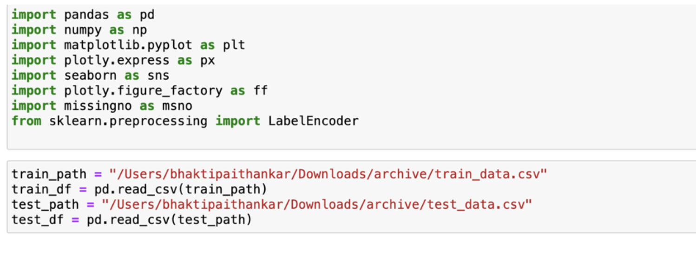
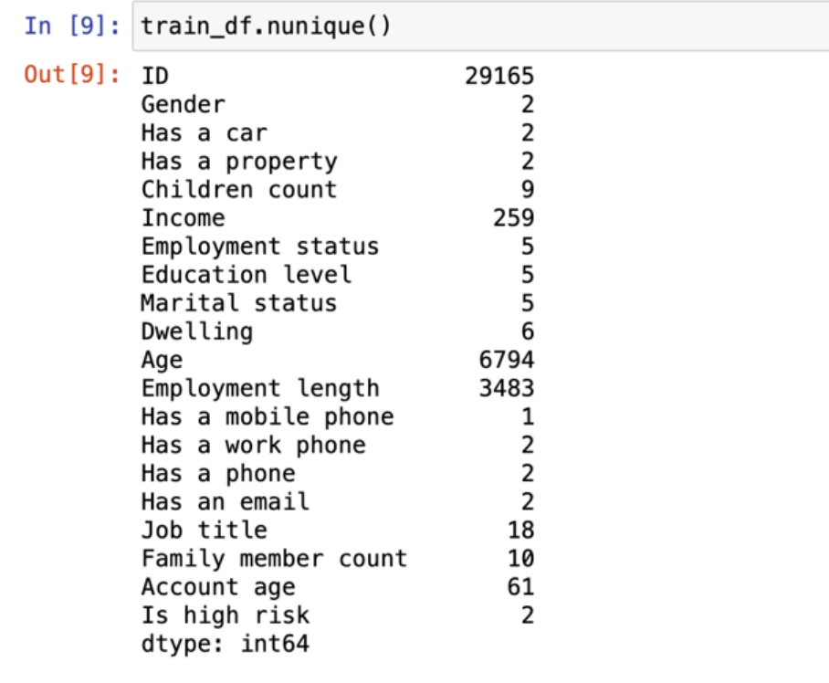
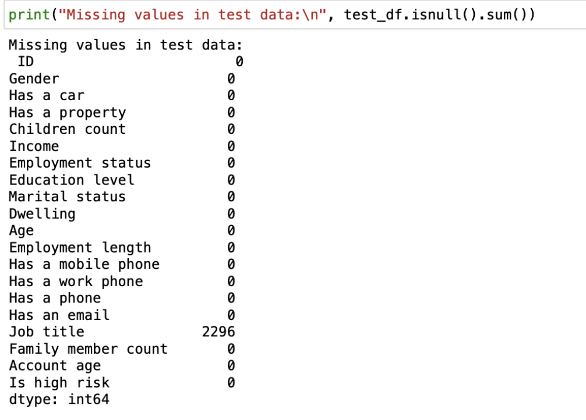
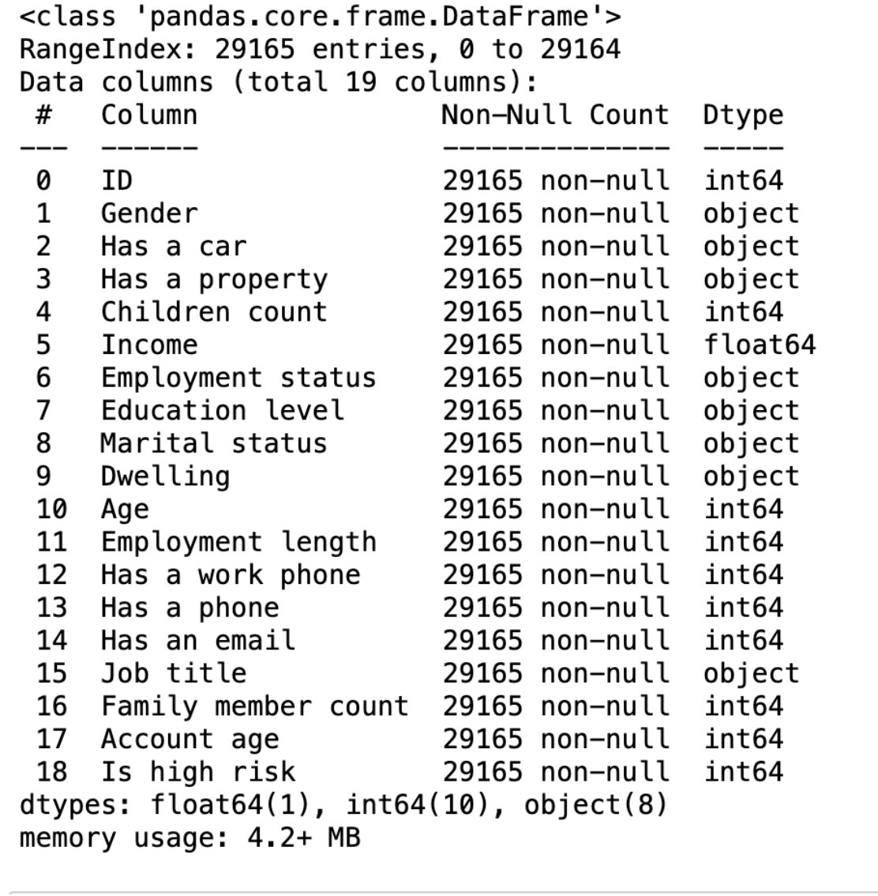
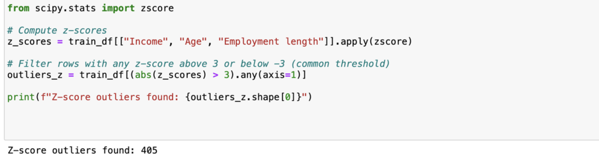
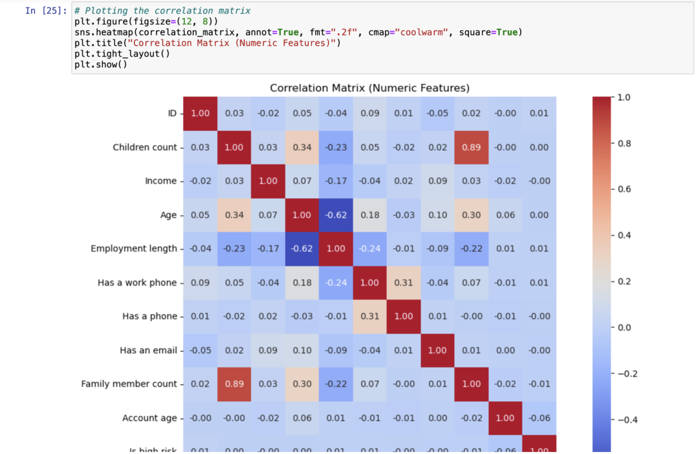
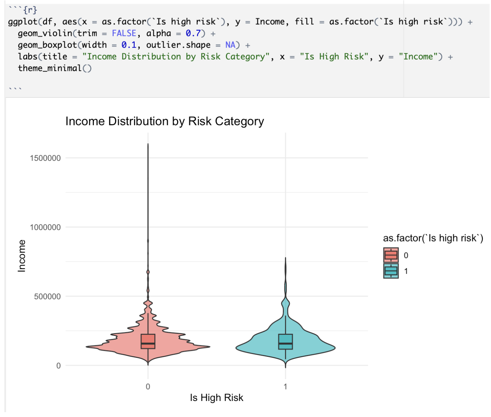
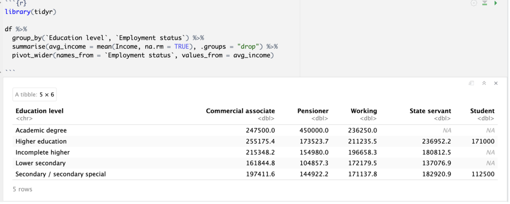
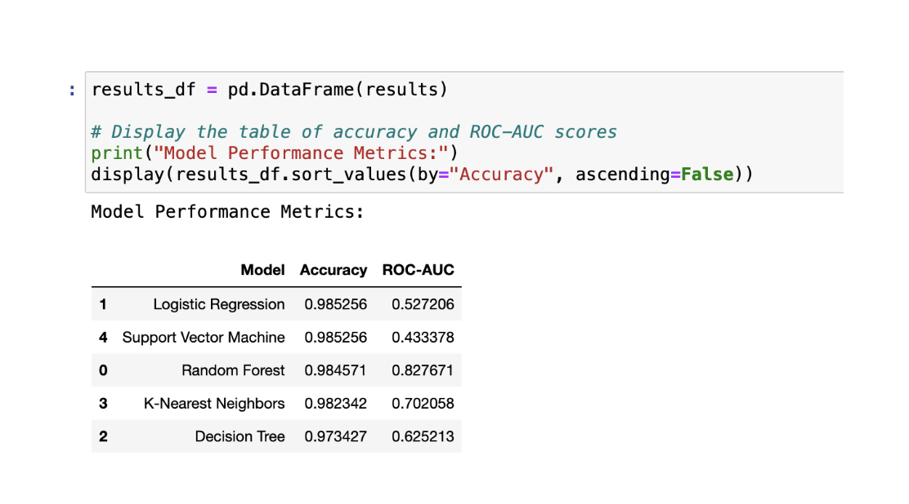
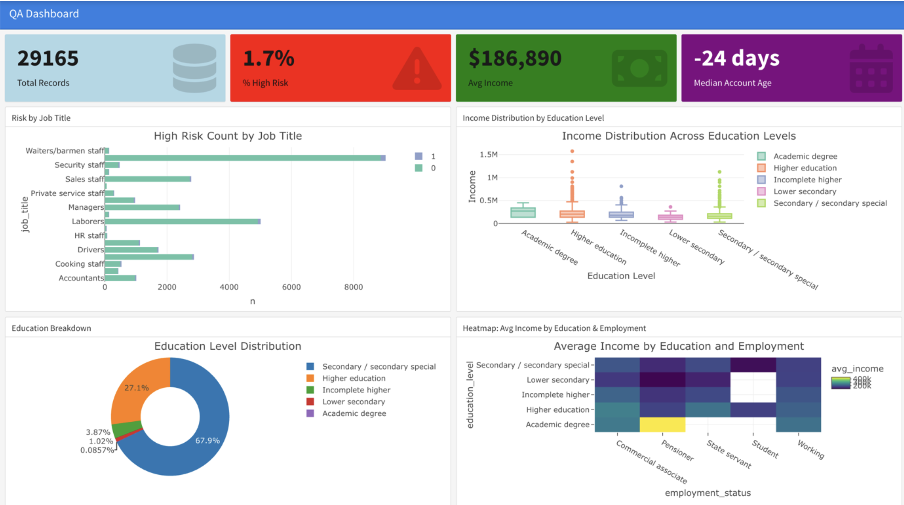

# 💳 Credit Risk Profiling & Behavioral Analysis 📊🧠  

## Project Overview  

This project focuses on building a **credit risk prediction system** using customer demographic, financial, and behavioral data.  

The goal is to identify whether a customer is **high risk (1) or low risk (0)** by leveraging **data analysis, visualization, and machine learning models**.  

The dataset contains ~29,000+ records with features like income, employment, education, and account details. 

---

## Problem Statement 🎯  

Financial institutions need to assess customer risk before approving loans or credit services.  

However, challenges include:  
- High-dimensional customer data  
- Missing or inconsistent values  
- Difficulty identifying key risk drivers  

This project solves the problem by:  
- Cleaning and analyzing financial data  
- Building predictive models  
- Creating dashboards for decision-making  

---

## Tech Stack 🛠️  

- **Python (Pandas, NumPy, Scikit-learn)** – Data processing & modeling  
- **Seaborn, Matplotlib, Plotly** – Visualization  
- **R (ggplot2, dplyr)** – Statistical analysis, dashboarding
- **Excel** – Data handling  

---

## Dataset Overview 📂  

- **29,165 training records & 7,000+ test records** 
- Features include:  
  - Demographics (Age, Gender)  
  - Financial (Income, Property, Car ownership)  
  - Employment (Status, Length, Job Title)  
  - Family & Lifestyle attributes  
- Target Variable: **Is High Risk (0/1)**
  
   ⁠
  
    ⁠
  

---

## Data Cleaning & Preparation 🧹  

- Removed duplicates (none found)  
- Handled missing values:  
  - **Job Title (~9000 missing values → replaced with "Unknown")** 
- Dropped uninformative column:  
  - *Has a mobile phone* (no variance)  
- Encoded categorical variables using **Label Encoding**  
- Imputed missing values using **median strategy**  

  ⁠

  ⁠
  
### Outlier Detection
  ⁠

---

## Exploratory Data Analysis (EDA) 📊  

### Correlation Matrix  

  ⁠

- Strong relationships observed between:  
  - Age & Employment Length (negative correlation)  
  - Family Size & Children Count (positive correlation)  

---

### Income vs Risk Distribution  

  ⁠

- High-risk individuals tend to show **distinct income distributions**  
- Variability in income is higher among risky customers  

---

### Education & Employment Analysis  

  ⁠
  
- Higher education correlates with higher income  
- Employment status significantly impacts earnings  

---

## Feature Engineering ⚙️  

- Converted categorical features using Label Encoding  
- Removed irrelevant features (ID, Job Title, etc.)  
- Standardized numeric features  
- Detected outliers using **Z-score method (~405 outliers)**  

---

## Machine Learning Models 🤖  

The following models were implemented:

- Logistic Regression  
- Random Forest  
- Decision Tree  
- K-Nearest Neighbors  
- Support Vector Machine  

### Model Performance  

  ⁠

**Key Results:**  
- Logistic Regression & SVM → High accuracy (~98%)  
- Random Forest → Best ROC-AUC (~0.82)  
- KNN & Decision Tree → Moderate performance  

---

## R Dashboard 📊  

### Credit Risk Dashboard  

  ⁠

**Key Metrics:**  
- Total Records: 29,165  
- High Risk %: ~1.7%  
- Average Income: ~$186K  
- Median Account Age: -24 days  

---

## Key Insights 💡  

- Income and employment are strong predictors of credit risk  
- Education level impacts earning potential and risk level  
- Certain job roles show higher concentrations of risky customers  
- Family size and financial stability influence risk probability  

---

## Trends & Analysis 📈  

1. **Income Distribution:** High-risk customers show wider variability  
2. **Employment Factor:** Stable jobs → lower risk  
3. **Demographics Impact:** Age & experience reduce risk likelihood  
4. **Behavioral Signals:** Ownership (car/property) indicates financial stability  

---

## Recommendations 🚀  

### For Financial Institutions  
- Use ML models (Random Forest) for risk scoring  
- Focus on income + employment as primary indicators  

### For Data Teams  
- Implement automated pipelines for real-time scoring  
- Monitor model drift over time  

### For Business Strategy  
- Target low-risk customers for credit expansion  
- Design risk-based pricing strategies  

---

## Conclusion 🧠  

This project demonstrates how combining **EDA, machine learning, and visualization** can effectively predict credit risk.  

It provides a **data-driven framework** for financial institutions to make smarter lending decisions.

---

## Future Improvements 🔮  

- Hyperparameter tuning for better model performance  
- Deep learning models for prediction  
- Real-time risk scoring system  
- Integration with financial APIs  

